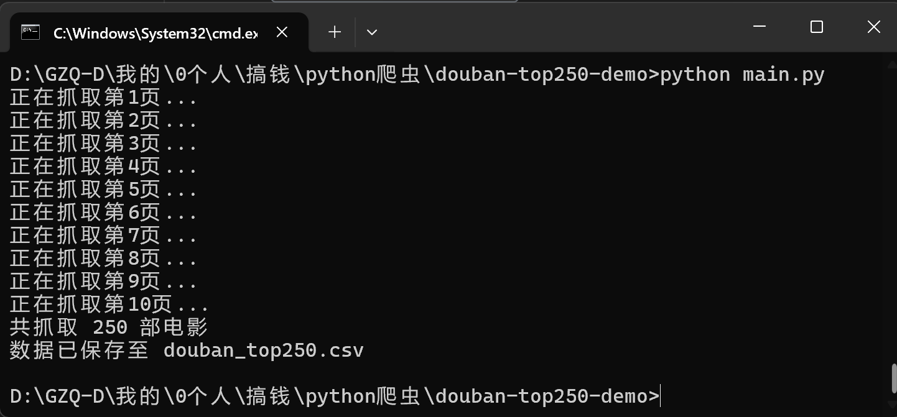
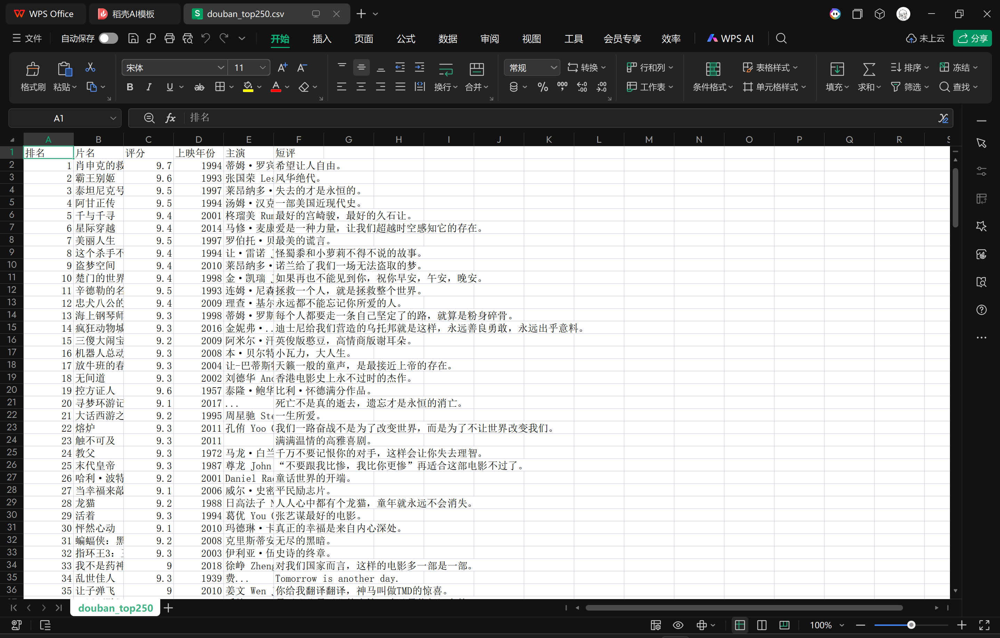

\# 豆瓣电影 Top250 爬虫 Demo

\# 功能

爬取豆瓣电影 Top250 排行榜

提取排名、片名、豆瓣评分、评价人数、经典短评

结果保存为 CSV 文件（可用 Excel 直接打开）

\# 运行环境

Python 3.7+

\# 运行方法

打开电脑终端进入当前文件夹（文件夹顶部路径位置输入cmd，回车进入终端，逐行复制下面代码右键黏贴，回车运行）

pip install -r requirements.txt -i https://pypi.tuna.tsinghua.edu.cn/simple --trusted-host pypi.tuna.tsinghua.edu.cn

python main.py

